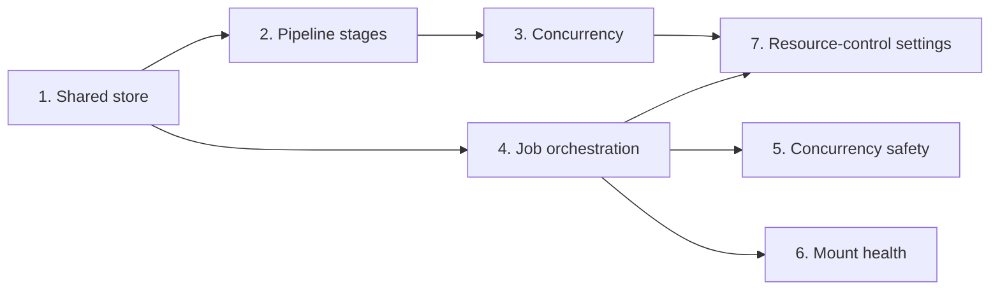

# Horizontal Plan: Scalable Scan Engine

Layers touched by this epic, and the cross-layer dependencies between them.

## Layers

1. **Shared checkpoint/store layer (new).** A single sqlite-backed module
   (WAL mode, real busy-timeout) providing: incremental unit-of-work
   completion tracking (generic — a "directory," a "file," an "address" are
   all just a string id to this layer), run-identity validation (so a
   checkpoint for a different input doesn't get reused by accident), and a
   cooperative pause/cancel signal. This is the foundation every other
   layer below builds on. Extracted from `search_wallets.py`'s already-
   working sqlite checkpoint (shipped tonight) generalized to serve every
   stage, not built from scratch.

2. **Pipeline stage layer.** `search_wallets.py` (already on the shared
   design, formalize the extraction), `analyze_wallets.py` (net-new resume
   support — today has none), `check_wallet_balances.py` (checkpoint writes
   re-pointed at the shared store; concurrency design unchanged per §5b),
   `crawl_transaction_graph.py` (checkpoint writes re-pointed at the shared
   store; lowest priority — no live incident here, but the format-
   proliferation cleanup goal from §4.1 includes it eventually).

3. **Concurrency layer.** New: `multiprocessing.Pool` for analyze (CPU-
   bound, justified per §4.2b). New: a thread pool for the search-walk
   stage (I/O-bound, §4.2a). Unchanged: check_balances' existing
   `ThreadPoolExecutor` + per-coin semaphore design (§5b verdict).

4. **Job orchestration layer.** `web/jobs.py`'s in-memory registry migrates
   to the shared store (§4.3) so job existence/status survive an app
   restart. New: a cooperative pause signal wired from a UI action through
   to each stage's worker loop (checked at the same points checkpoints
   already flush — no new polling loop needed).

5. **Concurrency-safety layer.** Extend the existing `find`-only duplicate-
   job guard (`web/app.py`'s `_running_find_job_for`) to `check-balances`
   jobs too (§4.4) — same pattern, second call site.

6. **Mount-health layer.** Wire the already-existing `is_mounted()` health
   check into the long-running scan loop itself (§4.5), not just page-load
   and the mounts-management UI.

7. **Settings/resource-control layer (new).** A settings module + UI
   surfacing every worker-count/concurrency knob from layers 3 and above as
   real, runtime-adjustable settings (§4.6): a named profile (Low/Balanced/
   Max) with sensible per-stage defaults, plus an advanced section with
   direct per-stage numeric overrides (both required, confirmed with user).

## Cross-layer dependencies

Layer 1 (store) has no dependencies — it's the true foundation. Layers 2-6
each depend on it directly or transitively. Layer 7 (settings) depends on
layers 3 and 4 existing first, since it's exposing controls for knobs that
don't exist as tunables yet.
